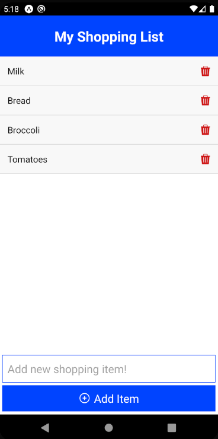

# Shopping List

[Live Preview](https://expo.io/@jalalo/shoppinglist) 🚀

> A sample shopping list application which I created while coding along with Brad Traversy in his React Native Crash Course with some tweaks made by myself. Those tweaks include creating the project based on TypeScript, implementing React Native Extended StyleSheet for styling, React Native Async Storage for caching items (this is the equivalent of local storage in browser web apps) and also some minor UI changes and additional alerts.

### Tech Stack

- React Native
- TypeScript
- React Native Extended StyleSheet
- React Native Async Storage
- Expo CLI

---

### Screenshot

